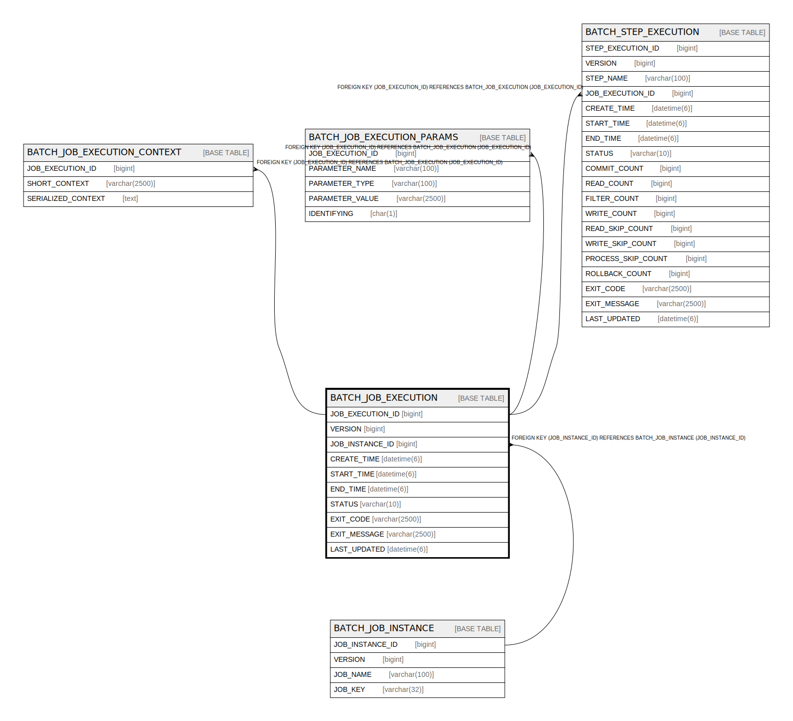

# BATCH_JOB_EXECUTION

## Description

<details>
<summary><strong>Table Definition</strong></summary>

```sql
CREATE TABLE `BATCH_JOB_EXECUTION` (
  `JOB_EXECUTION_ID` bigint NOT NULL,
  `VERSION` bigint DEFAULT NULL,
  `JOB_INSTANCE_ID` bigint NOT NULL,
  `CREATE_TIME` datetime(6) NOT NULL,
  `START_TIME` datetime(6) DEFAULT NULL,
  `END_TIME` datetime(6) DEFAULT NULL,
  `STATUS` varchar(10) DEFAULT NULL,
  `EXIT_CODE` varchar(2500) DEFAULT NULL,
  `EXIT_MESSAGE` varchar(2500) DEFAULT NULL,
  `LAST_UPDATED` datetime(6) DEFAULT NULL,
  PRIMARY KEY (`JOB_EXECUTION_ID`),
  KEY `JOB_INST_EXEC_FK` (`JOB_INSTANCE_ID`),
  CONSTRAINT `JOB_INST_EXEC_FK` FOREIGN KEY (`JOB_INSTANCE_ID`) REFERENCES `BATCH_JOB_INSTANCE` (`JOB_INSTANCE_ID`)
) ENGINE=InnoDB DEFAULT CHARSET=utf8mb4 COLLATE=utf8mb4_0900_ai_ci
```

</details>

## Columns

| Name | Type | Default | Nullable | Children | Parents | Comment |
| ---- | ---- | ------- | -------- | -------- | ------- | ------- |
| JOB_EXECUTION_ID | bigint |  | false | [BATCH_JOB_EXECUTION_CONTEXT](BATCH_JOB_EXECUTION_CONTEXT.md) [BATCH_JOB_EXECUTION_PARAMS](BATCH_JOB_EXECUTION_PARAMS.md) [BATCH_STEP_EXECUTION](BATCH_STEP_EXECUTION.md) |  |  |
| VERSION | bigint |  | true |  |  |  |
| JOB_INSTANCE_ID | bigint |  | false |  | [BATCH_JOB_INSTANCE](BATCH_JOB_INSTANCE.md) |  |
| CREATE_TIME | datetime(6) |  | false |  |  |  |
| START_TIME | datetime(6) |  | true |  |  |  |
| END_TIME | datetime(6) |  | true |  |  |  |
| STATUS | varchar(10) |  | true |  |  |  |
| EXIT_CODE | varchar(2500) |  | true |  |  |  |
| EXIT_MESSAGE | varchar(2500) |  | true |  |  |  |
| LAST_UPDATED | datetime(6) |  | true |  |  |  |

## Constraints

| Name | Type | Definition |
| ---- | ---- | ---------- |
| JOB_INST_EXEC_FK | FOREIGN KEY | FOREIGN KEY (JOB_INSTANCE_ID) REFERENCES BATCH_JOB_INSTANCE (JOB_INSTANCE_ID) |
| PRIMARY | PRIMARY KEY | PRIMARY KEY (JOB_EXECUTION_ID) |

## Indexes

| Name | Definition |
| ---- | ---------- |
| JOB_INST_EXEC_FK | KEY JOB_INST_EXEC_FK (JOB_INSTANCE_ID) USING BTREE |
| PRIMARY | PRIMARY KEY (JOB_EXECUTION_ID) USING BTREE |

## Relations



---

> Generated by [tbls](https://github.com/k1LoW/tbls)
