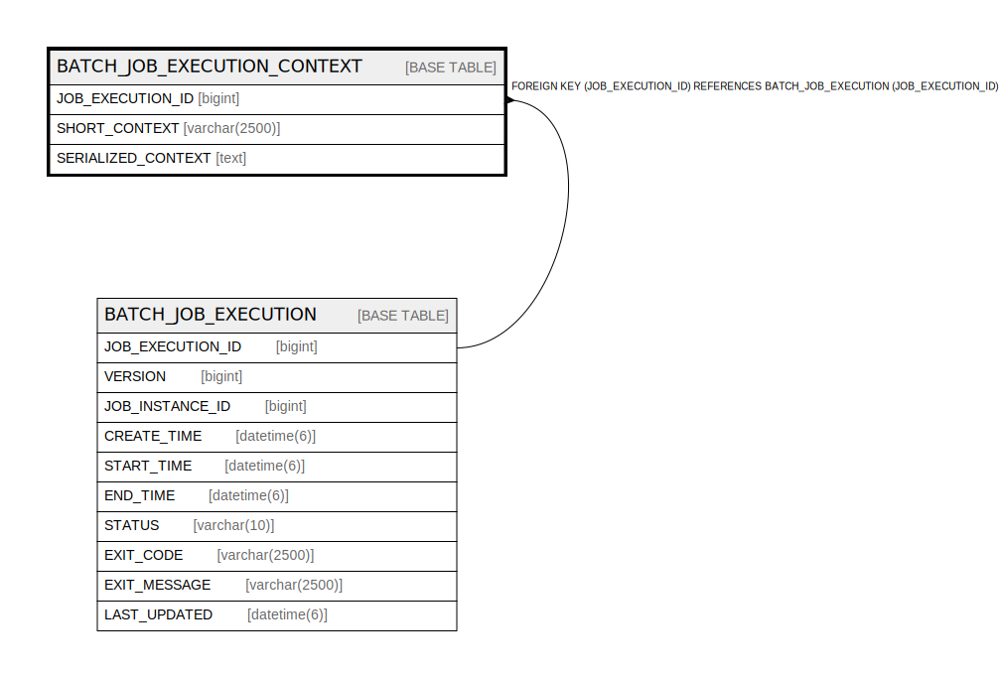

# BATCH_JOB_EXECUTION_CONTEXT

## Description

<details>
<summary><strong>Table Definition</strong></summary>

```sql
CREATE TABLE `BATCH_JOB_EXECUTION_CONTEXT` (
  `JOB_EXECUTION_ID` bigint NOT NULL,
  `SHORT_CONTEXT` varchar(2500) NOT NULL,
  `SERIALIZED_CONTEXT` text,
  PRIMARY KEY (`JOB_EXECUTION_ID`),
  CONSTRAINT `JOB_EXEC_CTX_FK` FOREIGN KEY (`JOB_EXECUTION_ID`) REFERENCES `BATCH_JOB_EXECUTION` (`JOB_EXECUTION_ID`)
) ENGINE=InnoDB DEFAULT CHARSET=utf8mb4 COLLATE=utf8mb4_0900_ai_ci
```

</details>

## Columns

| Name | Type | Default | Nullable | Children | Parents | Comment |
| ---- | ---- | ------- | -------- | -------- | ------- | ------- |
| JOB_EXECUTION_ID | bigint |  | false |  | [BATCH_JOB_EXECUTION](BATCH_JOB_EXECUTION.md) |  |
| SHORT_CONTEXT | varchar(2500) |  | false |  |  |  |
| SERIALIZED_CONTEXT | text |  | true |  |  |  |

## Constraints

| Name | Type | Definition |
| ---- | ---- | ---------- |
| JOB_EXEC_CTX_FK | FOREIGN KEY | FOREIGN KEY (JOB_EXECUTION_ID) REFERENCES BATCH_JOB_EXECUTION (JOB_EXECUTION_ID) |
| PRIMARY | PRIMARY KEY | PRIMARY KEY (JOB_EXECUTION_ID) |

## Indexes

| Name | Definition |
| ---- | ---------- |
| PRIMARY | PRIMARY KEY (JOB_EXECUTION_ID) USING BTREE |

## Relations



---

> Generated by [tbls](https://github.com/k1LoW/tbls)
