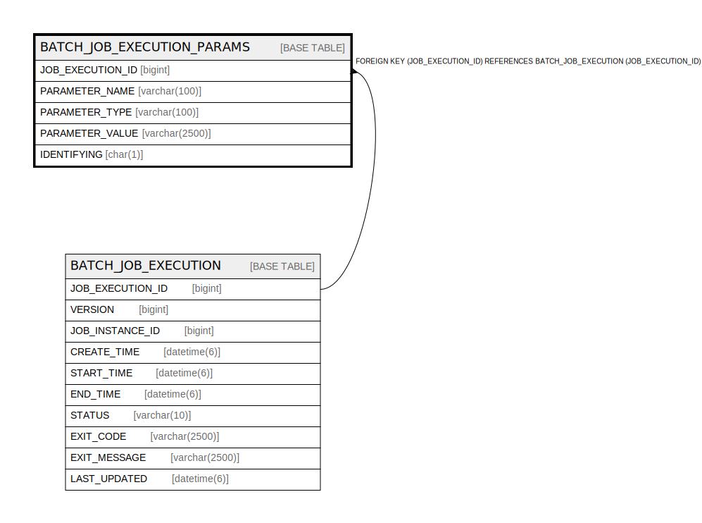

# BATCH_JOB_EXECUTION_PARAMS

## Description

<details>
<summary><strong>Table Definition</strong></summary>

```sql
CREATE TABLE `BATCH_JOB_EXECUTION_PARAMS` (
  `JOB_EXECUTION_ID` bigint NOT NULL,
  `PARAMETER_NAME` varchar(100) NOT NULL,
  `PARAMETER_TYPE` varchar(100) NOT NULL,
  `PARAMETER_VALUE` varchar(2500) DEFAULT NULL,
  `IDENTIFYING` char(1) NOT NULL,
  KEY `JOB_EXEC_PARAMS_FK` (`JOB_EXECUTION_ID`),
  CONSTRAINT `JOB_EXEC_PARAMS_FK` FOREIGN KEY (`JOB_EXECUTION_ID`) REFERENCES `BATCH_JOB_EXECUTION` (`JOB_EXECUTION_ID`)
) ENGINE=InnoDB DEFAULT CHARSET=utf8mb4 COLLATE=utf8mb4_0900_ai_ci
```

</details>

## Columns

| Name | Type | Default | Nullable | Children | Parents | Comment |
| ---- | ---- | ------- | -------- | -------- | ------- | ------- |
| JOB_EXECUTION_ID | bigint |  | false |  | [BATCH_JOB_EXECUTION](BATCH_JOB_EXECUTION.md) |  |
| PARAMETER_NAME | varchar(100) |  | false |  |  |  |
| PARAMETER_TYPE | varchar(100) |  | false |  |  |  |
| PARAMETER_VALUE | varchar(2500) |  | true |  |  |  |
| IDENTIFYING | char(1) |  | false |  |  |  |

## Constraints

| Name | Type | Definition |
| ---- | ---- | ---------- |
| JOB_EXEC_PARAMS_FK | FOREIGN KEY | FOREIGN KEY (JOB_EXECUTION_ID) REFERENCES BATCH_JOB_EXECUTION (JOB_EXECUTION_ID) |

## Indexes

| Name | Definition |
| ---- | ---------- |
| JOB_EXEC_PARAMS_FK | KEY JOB_EXEC_PARAMS_FK (JOB_EXECUTION_ID) USING BTREE |

## Relations



---

> Generated by [tbls](https://github.com/k1LoW/tbls)
