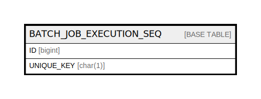

# BATCH_JOB_EXECUTION_SEQ

## Description

<details>
<summary><strong>Table Definition</strong></summary>

```sql
CREATE TABLE `BATCH_JOB_EXECUTION_SEQ` (
  `ID` bigint NOT NULL,
  `UNIQUE_KEY` char(1) NOT NULL,
  UNIQUE KEY `UNIQUE_KEY_UN` (`UNIQUE_KEY`)
) ENGINE=InnoDB DEFAULT CHARSET=utf8mb4 COLLATE=utf8mb4_0900_ai_ci
```

</details>

## Columns

| Name | Type | Default | Nullable | Children | Parents | Comment |
| ---- | ---- | ------- | -------- | -------- | ------- | ------- |
| ID | bigint |  | false |  |  |  |
| UNIQUE_KEY | char(1) |  | false |  |  |  |

## Constraints

| Name | Type | Definition |
| ---- | ---- | ---------- |
| UNIQUE_KEY_UN | UNIQUE | UNIQUE KEY UNIQUE_KEY_UN (UNIQUE_KEY) |

## Indexes

| Name | Definition |
| ---- | ---------- |
| UNIQUE_KEY_UN | UNIQUE KEY UNIQUE_KEY_UN (UNIQUE_KEY) USING BTREE |

## Relations



---

> Generated by [tbls](https://github.com/k1LoW/tbls)
