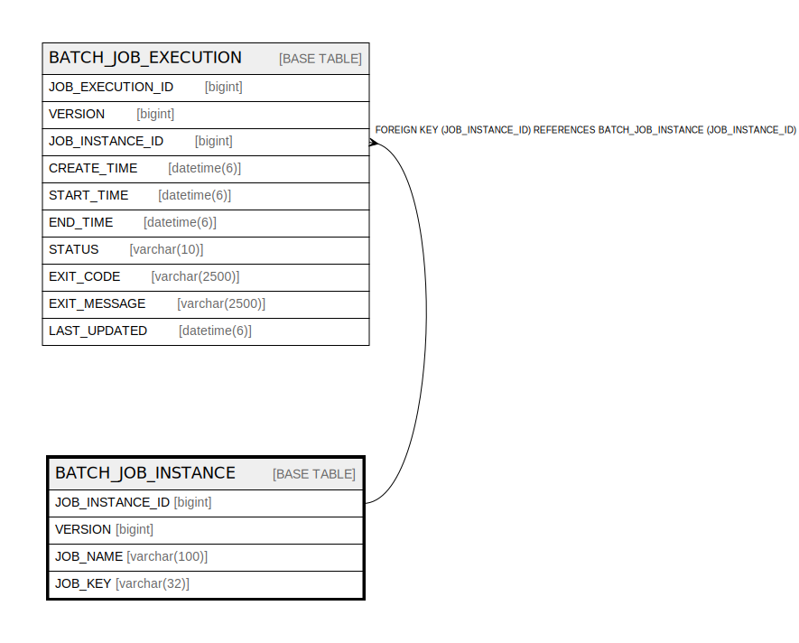

# BATCH_JOB_INSTANCE

## Description

<details>
<summary><strong>Table Definition</strong></summary>

```sql
CREATE TABLE `BATCH_JOB_INSTANCE` (
  `JOB_INSTANCE_ID` bigint NOT NULL,
  `VERSION` bigint DEFAULT NULL,
  `JOB_NAME` varchar(100) NOT NULL,
  `JOB_KEY` varchar(32) NOT NULL,
  PRIMARY KEY (`JOB_INSTANCE_ID`),
  UNIQUE KEY `JOB_INST_UN` (`JOB_NAME`,`JOB_KEY`)
) ENGINE=InnoDB DEFAULT CHARSET=utf8mb4 COLLATE=utf8mb4_0900_ai_ci
```

</details>

## Columns

| Name | Type | Default | Nullable | Children | Parents | Comment |
| ---- | ---- | ------- | -------- | -------- | ------- | ------- |
| JOB_INSTANCE_ID | bigint |  | false | [BATCH_JOB_EXECUTION](BATCH_JOB_EXECUTION.md) |  |  |
| VERSION | bigint |  | true |  |  |  |
| JOB_NAME | varchar(100) |  | false |  |  |  |
| JOB_KEY | varchar(32) |  | false |  |  |  |

## Constraints

| Name | Type | Definition |
| ---- | ---- | ---------- |
| JOB_INST_UN | UNIQUE | UNIQUE KEY JOB_INST_UN (JOB_NAME, JOB_KEY) |
| PRIMARY | PRIMARY KEY | PRIMARY KEY (JOB_INSTANCE_ID) |

## Indexes

| Name | Definition |
| ---- | ---------- |
| PRIMARY | PRIMARY KEY (JOB_INSTANCE_ID) USING BTREE |
| JOB_INST_UN | UNIQUE KEY JOB_INST_UN (JOB_NAME, JOB_KEY) USING BTREE |

## Relations



---

> Generated by [tbls](https://github.com/k1LoW/tbls)
