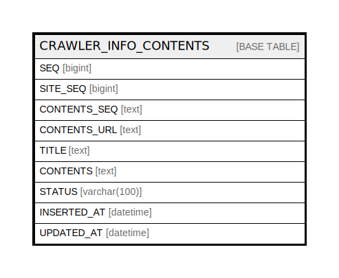

# CRAWLER_INFO_CONTENTS

## Description

크롤링 컨텐츠

<details>
<summary><strong>Table Definition</strong></summary>

```sql
CREATE TABLE `CRAWLER_INFO_CONTENTS` (
  `SEQ` bigint NOT NULL AUTO_INCREMENT COMMENT '순번',
  `SITE_SEQ` bigint NOT NULL COMMENT '크롤링 사이트',
  `CONTENTS_SEQ` text NOT NULL COMMENT '컨텐츠 번호(사이트 종속)',
  `CONTENTS_URL` text NOT NULL COMMENT '컨텐츠 URL',
  `TITLE` text COMMENT '컨텐츠 제목',
  `CONTENTS` text COMMENT '컨텐츠 ',
  `STATUS` varchar(100) NOT NULL DEFAULT 'ON_LOAD' COMMENT '로딩상태',
  `INSERTED_AT` datetime DEFAULT CURRENT_TIMESTAMP ON UPDATE CURRENT_TIMESTAMP COMMENT '생성일시',
  `UPDATED_AT` datetime DEFAULT CURRENT_TIMESTAMP ON UPDATE CURRENT_TIMESTAMP COMMENT '수정일시',
  PRIMARY KEY (`SEQ`)
) ENGINE=InnoDB AUTO_INCREMENT=[Redacted by tbls] DEFAULT CHARSET=utf8mb4 COLLATE=utf8mb4_0900_ai_ci COMMENT='크롤링 컨텐츠'
```

</details>

## Columns

| Name | Type | Default | Nullable | Extra Definition | Children | Parents | Comment |
| ---- | ---- | ------- | -------- | ---------------- | -------- | ------- | ------- |
| SEQ | bigint |  | false | auto_increment |  |  | 순번 |
| SITE_SEQ | bigint |  | false |  |  |  | 크롤링 사이트 |
| CONTENTS_SEQ | text |  | false |  |  |  | 컨텐츠 번호(사이트 종속) |
| CONTENTS_URL | text |  | false |  |  |  | 컨텐츠 URL |
| TITLE | text |  | true |  |  |  | 컨텐츠 제목 |
| CONTENTS | text |  | true |  |  |  | 컨텐츠  |
| STATUS | varchar(100) | ON_LOAD | false |  |  |  | 로딩상태 |
| INSERTED_AT | datetime | CURRENT_TIMESTAMP | true | DEFAULT_GENERATED on update CURRENT_TIMESTAMP |  |  | 생성일시 |
| UPDATED_AT | datetime | CURRENT_TIMESTAMP | true | DEFAULT_GENERATED on update CURRENT_TIMESTAMP |  |  | 수정일시 |

## Constraints

| Name | Type | Definition |
| ---- | ---- | ---------- |
| PRIMARY | PRIMARY KEY | PRIMARY KEY (SEQ) |

## Indexes

| Name | Definition |
| ---- | ---------- |
| PRIMARY | PRIMARY KEY (SEQ) USING BTREE |

## Relations



---

> Generated by [tbls](https://github.com/k1LoW/tbls)
