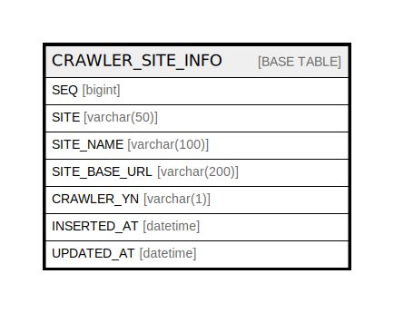

# CRAWLER_SITE_INFO

## Description

크롤링 사이트 정보

<details>
<summary><strong>Table Definition</strong></summary>

```sql
CREATE TABLE `CRAWLER_SITE_INFO` (
  `SEQ` bigint NOT NULL AUTO_INCREMENT COMMENT '순번',
  `SITE` varchar(50) NOT NULL COMMENT '크롤링 사이트',
  `SITE_NAME` varchar(100) DEFAULT NULL COMMENT '사이트 한글명',
  `SITE_BASE_URL` varchar(200) NOT NULL /*!80023 INVISIBLE */ COMMENT '크롤링 사이트 주소',
  `CRAWLER_YN` varchar(1) NOT NULL DEFAULT 'Y' COMMENT '크롤링 유무',
  `INSERTED_AT` datetime DEFAULT CURRENT_TIMESTAMP ON UPDATE CURRENT_TIMESTAMP COMMENT '생성일시',
  `UPDATED_AT` datetime DEFAULT CURRENT_TIMESTAMP ON UPDATE CURRENT_TIMESTAMP COMMENT '수정일시',
  PRIMARY KEY (`SEQ`)
) ENGINE=InnoDB AUTO_INCREMENT=[Redacted by tbls] DEFAULT CHARSET=utf8mb4 COLLATE=utf8mb4_0900_ai_ci COMMENT='크롤링 사이트 정보'
```

</details>

## Columns

| Name | Type | Default | Nullable | Extra Definition | Children | Parents | Comment |
| ---- | ---- | ------- | -------- | ---------------- | -------- | ------- | ------- |
| SEQ | bigint |  | false | auto_increment |  |  | 순번 |
| SITE | varchar(50) |  | false |  |  |  | 크롤링 사이트 |
| SITE_NAME | varchar(100) |  | true |  |  |  | 사이트 한글명 |
| SITE_BASE_URL | varchar(200) |  | false | INVISIBLE |  |  | 크롤링 사이트 주소 |
| CRAWLER_YN | varchar(1) | Y | false |  |  |  | 크롤링 유무 |
| INSERTED_AT | datetime | CURRENT_TIMESTAMP | true | DEFAULT_GENERATED on update CURRENT_TIMESTAMP |  |  | 생성일시 |
| UPDATED_AT | datetime | CURRENT_TIMESTAMP | true | DEFAULT_GENERATED on update CURRENT_TIMESTAMP |  |  | 수정일시 |

## Constraints

| Name | Type | Definition |
| ---- | ---- | ---------- |
| PRIMARY | PRIMARY KEY | PRIMARY KEY (SEQ) |

## Indexes

| Name | Definition |
| ---- | ---------- |
| PRIMARY | PRIMARY KEY (SEQ) USING BTREE |

## Relations



---

> Generated by [tbls](https://github.com/k1LoW/tbls)
