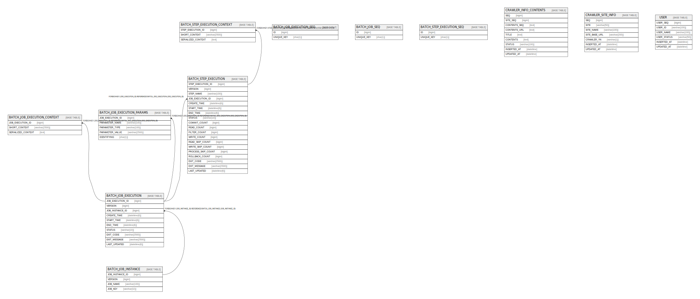

# local

## Tables

| Name | Columns | Comment | Type |
| ---- | ------- | ------- | ---- |
| [BATCH_JOB_EXECUTION](BATCH_JOB_EXECUTION.md) | 10 |  | BASE TABLE |
| [BATCH_JOB_EXECUTION_CONTEXT](BATCH_JOB_EXECUTION_CONTEXT.md) | 3 |  | BASE TABLE |
| [BATCH_JOB_EXECUTION_PARAMS](BATCH_JOB_EXECUTION_PARAMS.md) | 5 |  | BASE TABLE |
| [BATCH_JOB_EXECUTION_SEQ](BATCH_JOB_EXECUTION_SEQ.md) | 2 |  | BASE TABLE |
| [BATCH_JOB_INSTANCE](BATCH_JOB_INSTANCE.md) | 4 |  | BASE TABLE |
| [BATCH_JOB_SEQ](BATCH_JOB_SEQ.md) | 2 |  | BASE TABLE |
| [BATCH_STEP_EXECUTION](BATCH_STEP_EXECUTION.md) | 19 |  | BASE TABLE |
| [BATCH_STEP_EXECUTION_CONTEXT](BATCH_STEP_EXECUTION_CONTEXT.md) | 3 |  | BASE TABLE |
| [BATCH_STEP_EXECUTION_SEQ](BATCH_STEP_EXECUTION_SEQ.md) | 2 |  | BASE TABLE |
| [CRAWLER_INFO_CONTENTS](CRAWLER_INFO_CONTENTS.md) | 9 | 크롤링 컨텐츠 | BASE TABLE |
| [CRAWLER_SITE_INFO](CRAWLER_SITE_INFO.md) | 7 | 크롤링 사이트 정보 | BASE TABLE |
| [USER](USER.md) | 6 | 사용자 | BASE TABLE |

## Relations

---

> Generated by [tbls](https://github.com/k1LoW/tbls)
