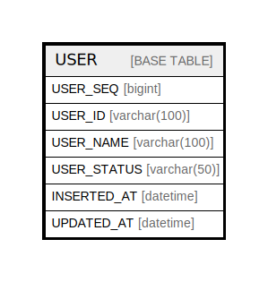

# USER

## Description

사용자

<details>
<summary><strong>Table Definition</strong></summary>

```sql
CREATE TABLE `USER` (
  `USER_SEQ` bigint NOT NULL AUTO_INCREMENT COMMENT '사용자 SEQ',
  `USER_ID` varchar(100) DEFAULT NULL COMMENT '사용자 아이디',
  `USER_NAME` varchar(100) DEFAULT NULL COMMENT '사용자 명',
  `USER_STATUS` varchar(50) DEFAULT NULL COMMENT '회원 상태',
  `INSERTED_AT` datetime DEFAULT CURRENT_TIMESTAMP ON UPDATE CURRENT_TIMESTAMP COMMENT '등록일자',
  `UPDATED_AT` datetime DEFAULT CURRENT_TIMESTAMP ON UPDATE CURRENT_TIMESTAMP COMMENT '수정일자',
  PRIMARY KEY (`USER_SEQ`)
) ENGINE=InnoDB AUTO_INCREMENT=[Redacted by tbls] DEFAULT CHARSET=utf8mb4 COLLATE=utf8mb4_0900_ai_ci COMMENT='사용자'
```

</details>

## Columns

| Name | Type | Default | Nullable | Extra Definition | Children | Parents | Comment |
| ---- | ---- | ------- | -------- | ---------------- | -------- | ------- | ------- |
| USER_SEQ | bigint |  | false | auto_increment |  |  | 사용자 SEQ |
| USER_ID | varchar(100) |  | true |  |  |  | 사용자 아이디 |
| USER_NAME | varchar(100) |  | true |  |  |  | 사용자 명 |
| USER_STATUS | varchar(50) |  | true |  |  |  | 회원 상태 |
| INSERTED_AT | datetime | CURRENT_TIMESTAMP | true | DEFAULT_GENERATED on update CURRENT_TIMESTAMP |  |  | 등록일자 |
| UPDATED_AT | datetime | CURRENT_TIMESTAMP | true | DEFAULT_GENERATED on update CURRENT_TIMESTAMP |  |  | 수정일자 |

## Constraints

| Name | Type | Definition |
| ---- | ---- | ---------- |
| PRIMARY | PRIMARY KEY | PRIMARY KEY (USER_SEQ) |

## Indexes

| Name | Definition |
| ---- | ---------- |
| PRIMARY | PRIMARY KEY (USER_SEQ) USING BTREE |

## Relations



---

> Generated by [tbls](https://github.com/k1LoW/tbls)
